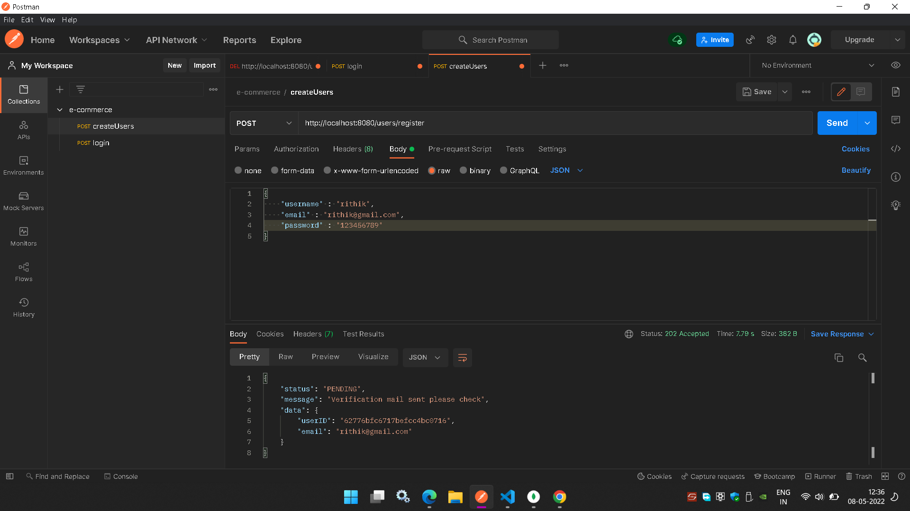
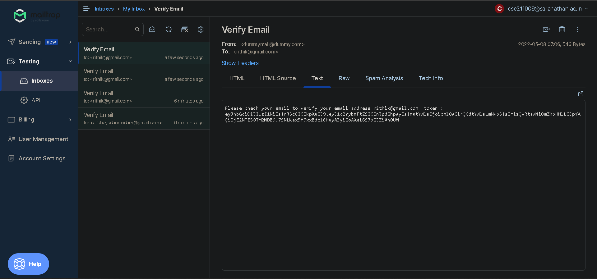
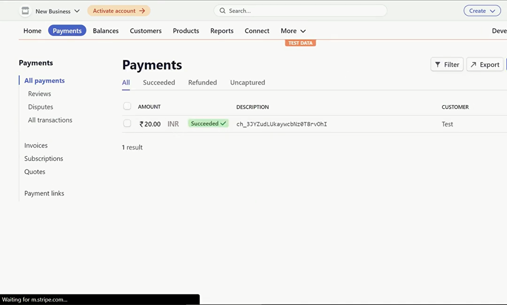

# E-Commerce-app

•	100% full-fledged RESTful API CRUD app using Express.JS with MongoDB as a persistence layer
•	Followed Test Driven Development (TDD) with proper test automation for integration test
•	Developed role-based authorization and authentication using JSON Web Token (JWT) as a refresh token
•	4-Layer architecture system consisting of Controllers, Services, Models, Routes, and Middleware
•	Users have two roles which is user and admin
•	Utilised stripe api for payments.
•	Users can add products to their cart, views their orders, wishlist their favourite product for later convenience.
•	Admins can update and delete any product and manage the user data being stored for altering orders status if cancellation is requested.
•	Verified with Jest for unit testing and Super-test for integration testing for bug free development.
•	Improved security by 35% by adding email-verification and two-factor authentication with support to pagination

ScreenShots :

